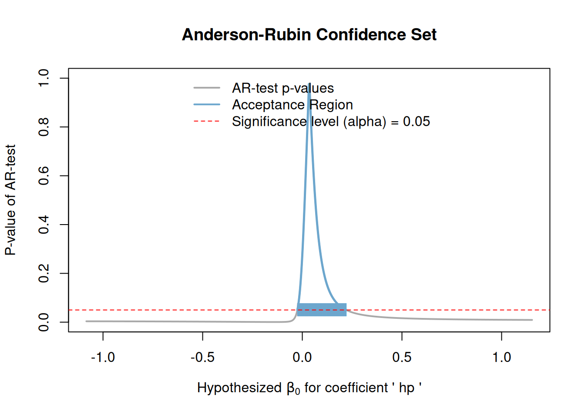

# Anderson-Rubin Confidence Intervals based on `feols` IV regression objects

In this vignette, we demonstrate how to compute Anderson-Rubin
confidence intervals for instrumental variables regression models
estimated using the `feols` function from the `fixest` package. The
Anderson-Rubin method provides robust inference in the presence of weak
instruments.

We will use the built-in `mtcars` dataset for illustration. In this
example, we will regress `mpg` (miles per gallon) on `cyl` (number of
cylinders) using `hp` (horsepower) as an endogenous regressor and `qsec`
(1/4 mile time) as an instrument.

First, we run a regression using `feols`.

Second, we compute the Anderson-Rubin confidence intervals for the
coefficient of the endogenous regressor `hp` using the `ar_ci` function
from the `arci` package.

Then, we visualize the results and extract the confidence intervals
using the `get_ar_ci` function.

Finally, we use `get_ar_ci` to extract the computed confidence intervals
in a tidy format.

``` r
library(arci)
```

``` r
library(fixest)

regression <- feols(mpg ~ cyl | hp ~ qsec, data = mtcars)
etable(regression)
#>                       regression
#> Dependent Var.:              mpg
#>                                 
#> Constant        39.65*** (3.115)
#> hp               0.0347 (0.0373)
#> cyl             -3.983** (1.251)
#> _______________ ________________
#> S.E. type                    IID
#> Observations                  32
#> R2                       0.73733
#> Adj. R2                  0.71921
#> ---
#> Signif. codes: 0 '***' 0.001 '**' 0.01 '*' 0.05 '.' 0.1 ' ' 1

arci_results <- ar_ci(regression, param = "hp", level = 0.95)
print(arci_results)
#> Anderson-Rubin95%Confidence Set for 'hp'
#> 
#> The confidence set is the union of the following interval(s):
#>   [-0.0247, 0.2193]

plot(arci_results)
```



``` r

get_ar_ci(regression)
#> [1] "[-0.025, 0.219]"
```
